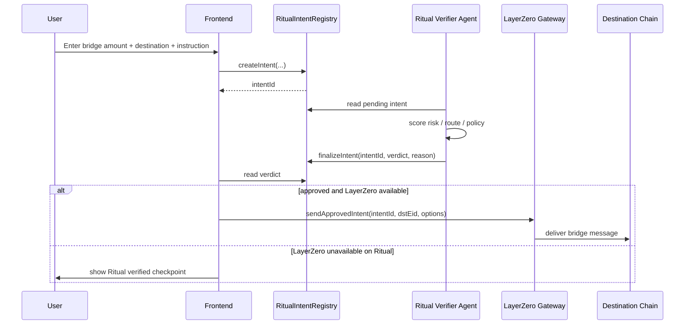

# Architecture

## Core Idea

Ritual Intent Bridge turns Ritual testnet into the decision layer for bridge actions.

Instead of trusting a frontend or a simple bridge button, each bridge action becomes an intent. Ritual stores that intent, runs policy/AI verification, and emits an auditable verdict.

## MVP Components

- `RitualIntentRegistry`: canonical on-chain log of bridge intents and verdicts.
- `RitualRiskOracle`: template contract for HTTP precompile scoring.
- `RitualLayerZeroGateway`: future LayerZero sender once Ritual has Endpoint V2 support.
- Static frontend: testnet demo UI for explaining and operating the flow.

## Flow

## Why This Fits Ritual

Ritual Chain supports precompiles for real-world computation such as HTTP, LLM, long-running jobs, and agents. A bridge is a strong use case because bridge actions benefit from policy decisions:

- Is this wallet high risk?
- Is this route safe?
- Is this amount abnormal?
- Does the instruction match the transaction?
- Should the system require review?

## Verdict Policy

Suggested initial policy:

- `APPROVED`: amount below threshold, recipient valid, no risk flags.
- `REVIEW`: new wallet, large amount, unknown destination, conflicting instruction.
- `REJECTED`: zero address, suspicious token, blocked wallet, malformed intent.

## Deployment Plan

1. Deploy `RitualIntentRegistry` to Ritual testnet.
2. Add your verifier wallet with `setVerifier`.
3. Use the frontend to create intents.
4. Build a small verifier worker that:
   - reads `IntentCreated`,
   - computes verdict,
   - calls `finalizeIntent`.
5. Add LayerZero flow after Ritual has Endpoint V2 details.

