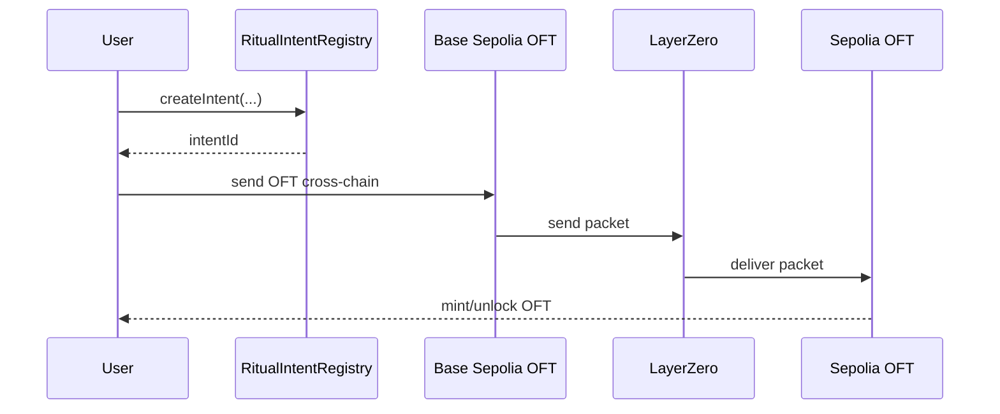

# Real Cross-Chain Bridge Plan

This project should use two layers:

1. Real bridge layer: LayerZero OFT across chains that already have LayerZero V2 endpoints.
2. Ritual layer: Ritual testnet stores bridge intents and verification verdicts.

## Important Constraint

Ritual Chain can only be a direct LayerZero bridge source or destination after LayerZero deploys an Endpoint V2 on Ritual.

Until then, the real bridge should run between supported testnets, for example:

- Base Sepolia -> Ethereum Sepolia
- Ethereum Sepolia -> Base Sepolia
- Base Sepolia -> Optimism Sepolia

Ritual remains valuable as the verification/checkpoint chain:

- store bridge intent,
- run AI or policy verification,
- approve/reject bridge action,
- show on-chain Ritual audit trail.

## Recommended MVP

Use `OmniRitualOFT.sol` as the real bridge token.

Deploy it on two LayerZero-supported testnets:

- Base Sepolia, EID `40245`
- Ethereum Sepolia, EID `40161`

Then wire peers through LayerZero tooling.

## User Flow



## LayerZero Setup Notes

Use LayerZero's official OFT scaffold for deployment tooling:

```bash
npx create-lz-oapp@latest
```

Choose `OFT example`, then copy `OmniRitualOFT.sol` into the generated contracts folder.

You need:

- funded deployer wallet on both chains,
- RPC URL for each testnet,
- LayerZero Endpoint IDs, not normal EVM chain IDs,
- peer wiring after deployment.

## Contract Roles

- `OmniRitualOFT.sol`: actual bridge token across LayerZero-supported chains.
- `RitualIntentRegistry.sol`: Ritual-side registry for bridge intent and verification.
- `RitualRiskOracle.sol`: optional Ritual HTTP precompile risk scoring.
- `RitualLayerZeroGateway.sol`: future direct Ritual LayerZero gateway when Endpoint V2 exists on Ritual.

